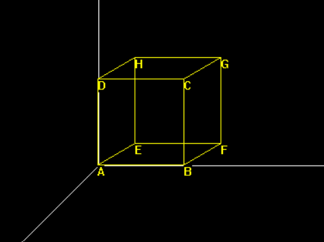
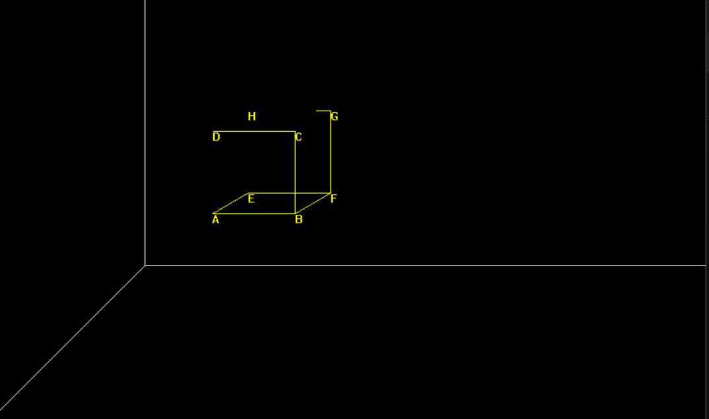
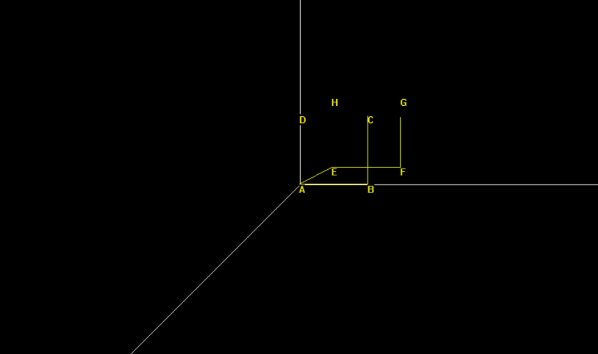
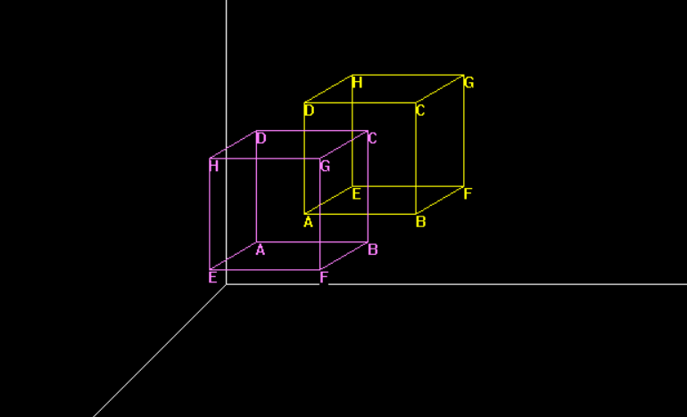

# Graphics Projects from Scratch

This repository contains a collection of graphics projects implemented from scratch in C++. It includes both 2D and 3D graphics projects, demonstrating various algorithms and techniques for drawing shapes, handling animations, and rendering 3D objects.

## 2D Graphics Project

This project is a simple graphics application that demonstrates various algorithms for drawing 2D shapes and animations using C++. It includes implementations of Bresenham's algorithm for lines and circles, polynomial and trigonometric methods for drawing circles and ellipses, and animations such as a clock and pendulum.

### 2D Features

- **Line Drawing**: Bresenham's line algorithm, Polynomial line algorithm


- **Circle Drawing**: Bresenham's circle algorithm, Polynomial circle algorithm, Trigonometric circle algorithm


- **Ellipse Drawing**: Bresenham's ellipse algorithm, Polynomial ellipse algorithm, Trigonometric ellipse algorithm, Ellipse with rotation


- **Animations**: Clock with real-time update, Pendulum, Flower pattern


### 2D Menu Options

- **1**: Draw a line using Bresenham's algorithm
- **2**: Draw a line using the polynomial method
- **3**: Draw a circle using Bresenham's algorithm
- **4**: Draw a circle using the polynomial method
- **5**: Draw a circle using the trigonometric method
- **6**: Draw an ellipse using Bresenham's algorithm
- **7**: Draw an ellipse using the polynomial method
- **8**: Draw an ellipse using the trigonometric method
- **9**: Draw a rotated ellipse
- **10**: Draw a clock
- **11**: Draw a pendulum
- **12**: Draw a flower pattern


## 3D Graphics Project

This project is a comprehensive exploration of 3D graphics concepts and transformations using C++. It includes various implementations such as drawing a simple cube, translations, rotations, symmetries, and more.

### 3D Features

- **Simple Cube Drawing**: Render a basic 3D cube.



- **Translations**: Move the cube along the X, Y, and Z axes.



- **Rotations**: Rotate the cube around the X, Y, and Z axes, as well as parallel rotations.
  


- **Symmetry**: Reflect the cube across different planes (XY, YZ, XZ).
  


- **Vector Alignment**: Align two arbitrary vectors.

### 3D Menu Options

```
 <---------------------[ 3D ]------------------->
 -----------------------------------------------
 | 1- Simple cube                               |
 | 2- Translation Par Rapport a X               |
 | 3- Translation Par Rapport a Y               |
 | 4- Translation Par Rapport a Z               |
 | 5- Rotation par Rapport X                    |
 | 6- Rotation par Rapport Y                    |
 | 7- Rotation par Rapport Z                    |
 | 8- Rotation Parallele Z                      |
 | 9- Rotation Parallele Y                      |
 |10- Rotation Quelconque                       |
 |11- Symetrie / XY                             |
 |12- Symetrie / YZ                             |
 |13- Symetrie / XZ                             |
 |14- Aligne 2 Vecteur Quelconque               |
```

### 3D File Descriptions

- **Axe.h**: Functions for handling 3D axes.
- **Cube.h**: Functions for defining and manipulating cubes.
- **DrawBasic.h**: Basic drawing utilities and coordinate system setup.
- **Exec.h**: Main execution functions and menu handling.
- **Rotation.h**: Functions for rotation transformations around X, Y, and Z axes.
- **RotationP.h**: Functions for parallel rotations.
- **RotationQ.h**: Functions for arbitrary rotations.
- **Symetrie.h**: Functions for symmetry transformations.
- **Translation.h**: Functions for translation transformations.
- **Vector.h**: Functions for vector manipulations.
- **main.cpp**: Entry point of the program, handles menu selection and execution.


## Requirements

- C++ compiler (e.g., GCC)
- Graphics library (e.g., BGI for Windows)

## Contact

For any questions or suggestions, please open an issue or contact [Maazouz AbdelAziz:](https://www.linkedin.com/in/abdelaziz-maazouz/)
