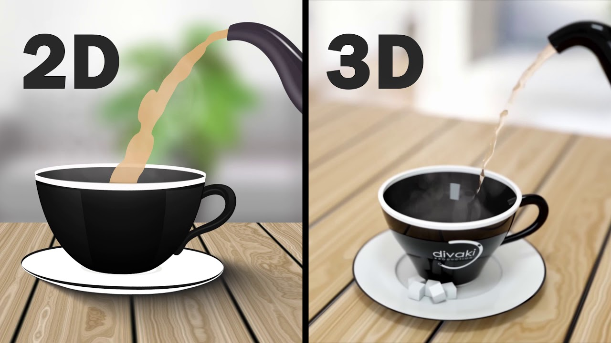
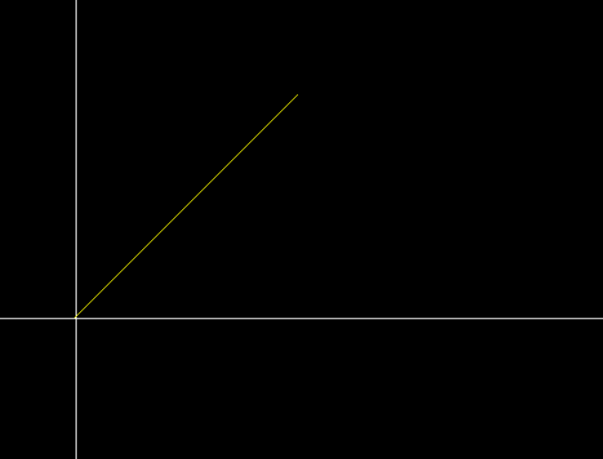
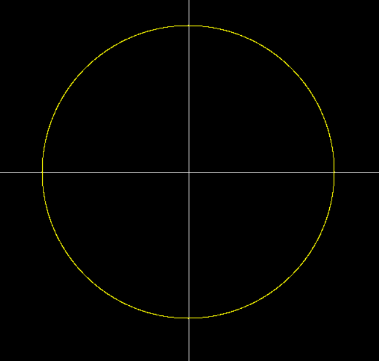
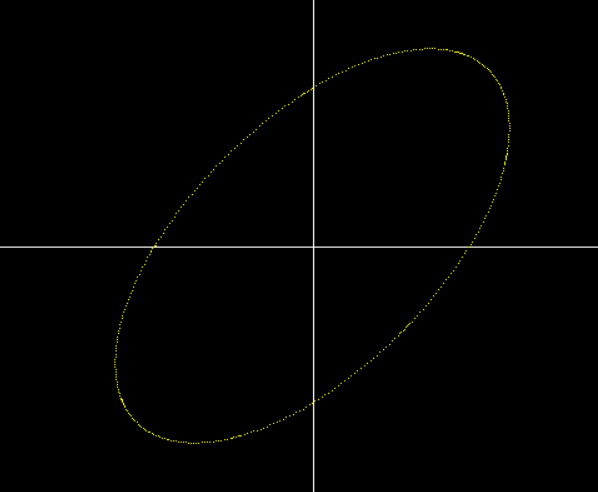
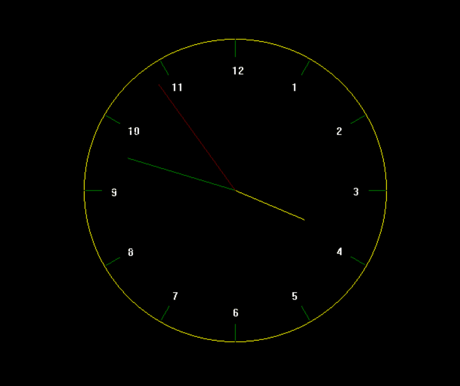

# Graphics Projects from Scratch

This repository contains a collection of graphics projects implemented from scratch in C++. It includes both 2D and 3D graphics projects, demonstrating various algorithms and techniques for drawing shapes, handling animations, and rendering 3D objects.

## 2D Graphics Project

This project is a simple graphics application that demonstrates various algorithms for drawing 2D shapes and animations using C++. It includes implementations of Bresenham's algorithm for lines and circles, polynomial and trigonometric methods for drawing circles and ellipses, and animations such as a clock and pendulum.

### Features

- **Line Drawing**: Bresenham's line algorithm, Polynomial line algorithm

- **Circle Drawing**: Bresenham's circle algorithm, Polynomial circle algorithm, Trigonometric circle algorithm

- **Ellipse Drawing**: Bresenham's ellipse algorithm, Polynomial ellipse algorithm, Trigonometric ellipse algorithm, Ellipse with rotation

- **Animations**: Clock with real-time update, Pendulum, Flower pattern

### Requirements

- C++ compiler (e.g., GCC)
- Graphics library (e.g., BGI for Windows)

### Menu Options

- **1**: Draw a line using Bresenham's algorithm
- **2**: Draw a line using the polynomial method
- **3**: Draw a circle using Bresenham's algorithm
- **4**: Draw a circle using the polynomial method
- **5**: Draw a circle using the trigonometric method
- **6**: Draw an ellipse using Bresenham's algorithm
- **7**: Draw an ellipse using the polynomial method
- **8**: Draw an ellipse using the trigonometric method
- **9**: Draw a rotated ellipse
- **10**: Draw a clock
- **11**: Draw a pendulum
- **12**: Draw a flower pattern

## Contact

For any questions or suggestions, please open an issue or contact [yourname](mailto:your.email@example.com).
